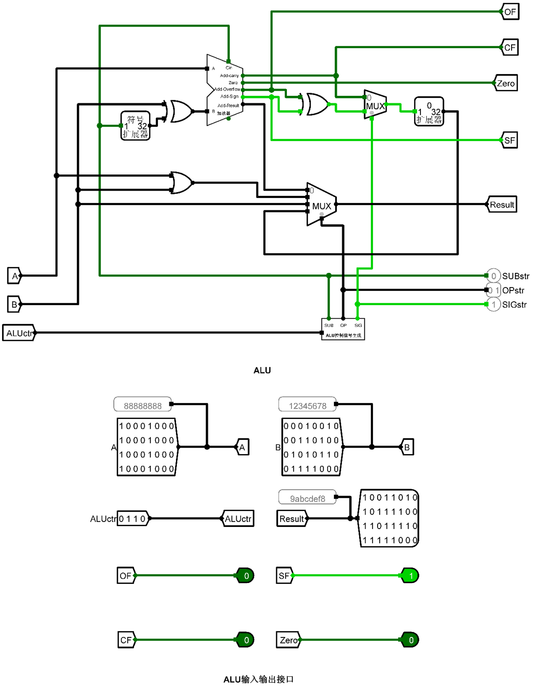

# Digital-Circuit-and-Computer-Organization-Labs

## 项目介绍

本项目包含四个数字电路和计算机组成实验，旨在帮助学生深入理解数字电路的基本原理和相关设计。实验中使用到的仿真软件包括 Logisim 和 RARS（RISC-V 汇编模拟器）。

## 目录结构

- `src/chapter-1/`: 数字电路实验
  - 描述：实现基本的数字电路，验证逻辑门、组合电路及时序电路的功能。
  
- `src/chapter-2/`: 运算器和存储器实验
  - 描述：设计和实现基本的算术运算器和存储器，理解数据的存储与处理过程。

- `src/chapter-3/`: RISC-V 汇编语言设计实验
  - 描述：使用 RISC-V 汇编语言进行程序设计，理解汇编语言与机器语言之间的关系。

- `src/chapter-4/`: CPU 指令设计实验
  - 描述：设计简单的 CPU 指令集，模拟指令的执行过程，加深对计算机组成原理的理解。

## 使用软件

本实验项目使用以下仿真软件：

- **Logisim**: 用于数字电路设计和仿真，帮助实现逻辑电路的功能验证。
- **RARS**: RISC-V 汇编语言模拟器，用于编写和测试 RISC-V 汇编程序。

## 注意事项

请确保在运行实验之前，已安装所需的软件工具。具体软件的安装和使用说明可以在各自的官方网站上找到。

## 许可证

本项目仅供学习和参考，未经授权请勿抄袭或用于商业用途。
